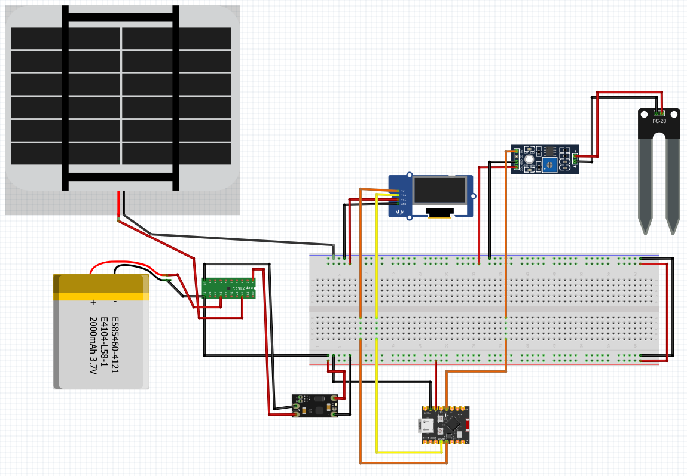
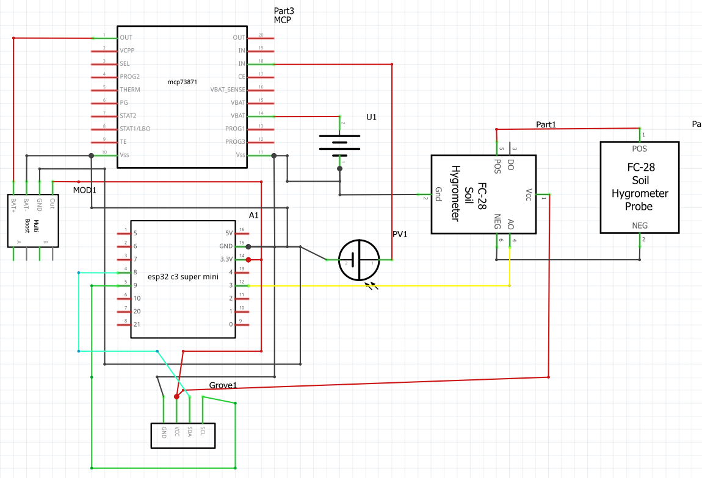

# Planto Smart
Planto smart is a smart orchard project developed in espressif esp-idf that helps to monitor the state of small plantations.

## Components
- ESP32C3 mini
- Solar panel + LiPO
- Hygrometer sonde
- Display

## Design
### Breadboard

### Schematic